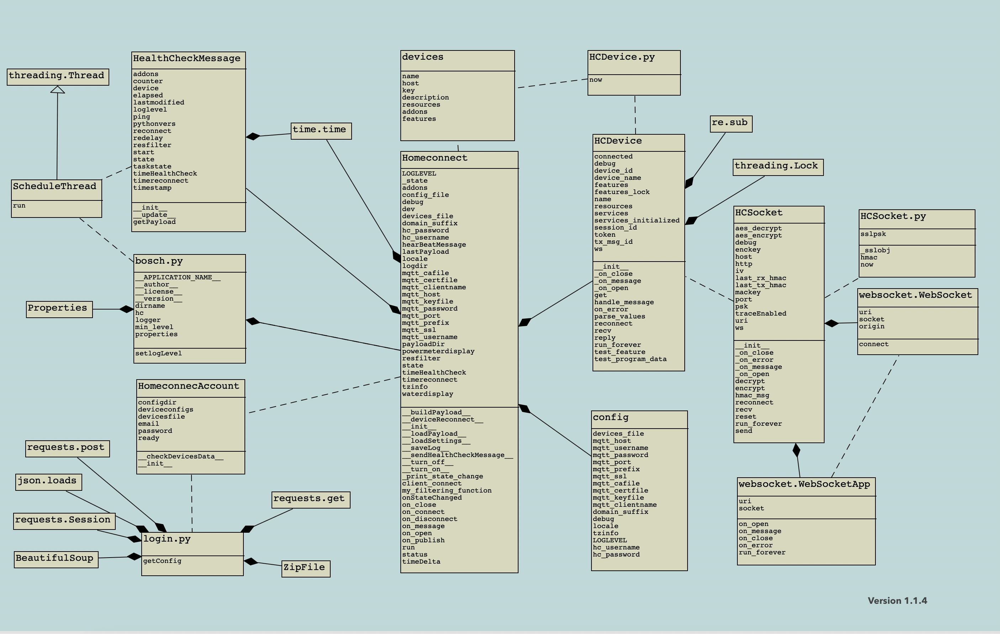
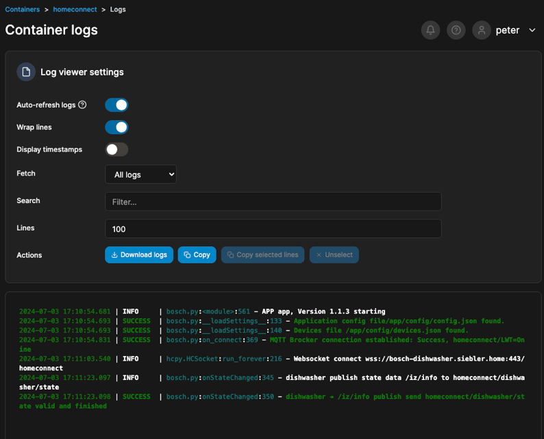
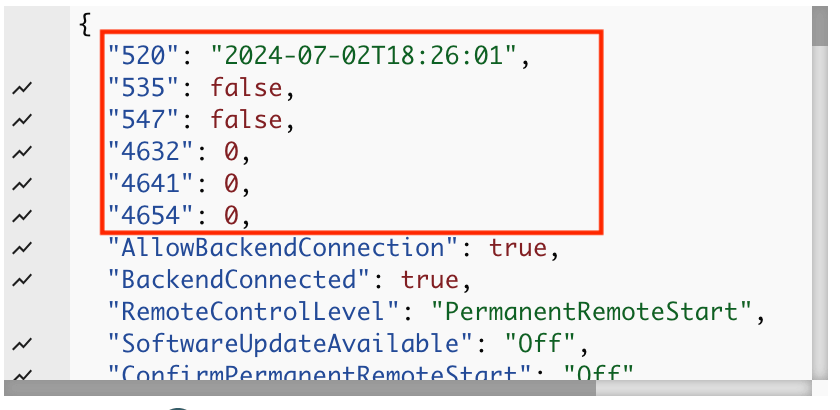

# Homeconnect  - hcpy for Bosch Dishwasher


[![License][license-shield]][license]
[![Open in Visual Studio Code][open-in-vscode-shield]][open-in-vscode]
[](https://www.python.org/downloads/release/python-3119/)


[![Support author][donate-me-shield]][donate-me]


[license-shield]: https://img.shields.io/static/v1?label=License&message=MIT&color=orange&logo=license
[license]: https://opensource.org/licenses/MIT

[open-in-vscode-shield]: https://img.shields.io/static/v1?label=+&message=Open+in+VSCode&color=blue&logo=visualstudiocode
[open-in-vscode]: https://open.vscode.dev/zibous/homeconnect-hcpy

[donate-me-shield]: https://img.shields.io/static/v1?label=+&color=orange&message=Buy+me+a+coffee
[donate-me]: https://www.buymeacoff.ee/zibous


Python tool to talk to Home Connect appliances over the local network (no cloud required)

## Device

Dishwasher Bosch SMV4HCX48E/24


## Interface with Home Connect appliances in Python

This is a very, very beta interface for Bosch-Siemens Home Connect
devices through their local network connection.  Unlike most
IoT devices that have a reputation for very bad security, BSG seem to have
done a decent job of designing their system, especially since
they allow a no-cloud local control configuration.  The protocols
seem sound, use well tested cryptographic libraries (TLS PSK with
modern ciphres) or well understood primitives (AES-CBC with HMAC),
and should prevent most any random attacker on your network from being able to
[take over your appliances to mine cryptocurrency](http://www.antipope.org/charlie/blog-static/2013/12/trust-me.html).

*WARNING: This tool not ready for prime time and is still beta!*

<br/>

**More Information for details see**:

[](https://github.com/hcpy2-0/hcpy)


### Used devices

- [Dishwasher Bosch `SMV4HCX48E/24`](https://amzn.eu/d/0id40Ixc)
- [Powermeter `Sonoff Pow`](https://tasmota.github.io/docs/devices/Sonoff-Pow/)
- [Watermeter `ESPHome+ESP32+CC1101`](https://github.com/zibous/ha-watermeter)


### Requirements
  - Python 3.11.9 or Docker app with Python 3.11.9
  - Valid singlekey-id account (username, password)
  - Device registered with singlekey-id account
  - [Application configuration (config.json)](./homeassistant/config_template.json)
  - [Homeconnect Devices configuration (devices.json)](./homeassistant/devices.json)


<br/>

## Setup

To avoid running into issues later with your default python installs, it's recommended to use a py virtual env for doing this.
I have had good experiences with `pyenv` With `pyenv` you can use your own Python versions / virtual environment for each application.<br/>

[](https://github.com/pyenv/pyenv)


## Python Setup

Go to your desired test directory (for example: /dockerapps/homeconnect), and:

```bash
⚡ root@linux: pyenv --version
⚡ root@linux: pyenv install 3.11.9
⚡ root@linux: pyenv virtualenv 3.11.9 apps
⚡ root@linux: cd /dockerapps
⚡ root@linux: git clone https://github.com/zibous/homeconnect-hcpy.git
⚡ root@linux: cd /dockerapps/homeconnect-hcpy
⚡ root@linux: pyenv local apps
⚡ root@linux: pip install -r requirements.txt
⚡ root@linux: pip install pipreqs
⚡ root@linux: pip install pyclean
```

<br/>


## Python APP

This application (`bosch.py`) will establish websockets to the local devices and
transform their messages into MQTT JSON messages.
The exact format is likely to change; it is currently a thin translation layer over
the XML retrieved from cloud servers during the initial configuration.
 <br/>

 #### Workflow

- Start App

  - Check and load [config.json](./homeassistant/config_template.json)
  - Check and load [devices.json](./homeassistant/devices_dishwasher.json)
    - If not present login to Homeconnect to get the devices.json
  - Connect local to the device
    - Get the device state data
  - Publish the device state data
    - [MQTT Payload](./homeassistant/payload.json)
    - Wait for next device state data

<br/>

#### APP Classes



<br/>

## Start Application

Template for the  `config.json` see: [config.json](./homeassistant/config_template.json)<br/>
After the `config.json` is valid in the ./config directory, the application can be started with the python command:

<br/>

```bash
⚡ root@linux: /dockerapps/homeconnect: python bosch.py
```


### First Start - creates the `devices.json`

If no `devices.json` is present, the application perfoms the
OAuth process to login to your Home Connect account with your usename and password. </br>
It receives a bearer token that can then be used to retrieves
a list of all the connected devices, their authentication
and encryption keys, and XML files that describe all of the
features and options and saves the data to the `devices.json`.

#### Requirements:

  - Valid singlekey-id account (username, password) see `devices.json`
  - Device registered with singlekey-id account

<br/>
This only needs to be done once or when you add new devices;
the resulting configuration JSON file *should* be sufficient to
connect to the devices on your local network, assuming that
your mDNS or DNS server resolves the names correctly.


#### TODO after first start

  - [ ] **check `config.json`**
    - [ ] if no `config.json` is present (hc_username, hc_password)

  - [ ] **check `devices.json`**
    - [ ] Check whether the device `host` is accessible via the network
    - [ ] Optional change `host`entry to `IP Address`
    - [ ] Optional add `resources` section to prevent 400/404 errors
    - [ ] Optional add `addons` section if a power meter, water meter is present

  - [ ] **Logging**
     - [ ] Change LOGLEVEL to `DEBUG`, see:`devices.json`

  - [ ] **Optiona Test** [hcpy Testcase](./hcpy_org/README.md)
       - [ ] check [Issues hcpy2-0](https://github.com/hcpy2-0/hcpy/issues)

<br>

Result for Dishwasher Bosch SMV4HCX48E/24 s
see: [devices.json](./homeassistant/devices_dishwasher.json)


<br><br>


### Docker APP
The application can also be installed with a Docker installation.
A local Docker image is created with `build.sh` and then installed.



Build script see:  [Docker build script](./build.sh)

<br/>

Go to your desired test directory, and:
```bash
⚡ root@linux: /dockerapps/homeconnect:  bash build.sh
```

<br/>

### Application logging loguru.logger


<br/><br/>

## What's Changed

-  **NEW hcpy lib files**
   - Replace print, dprint with `loguru.logger`

- **h2mqtt.py**
   - `bosch.app` instead of `h2mqtt.py`
   - `bosch.app` included `hc-login` to get the `devices.json` on first start
   - loading `settings.json` instead of `settings.ini`
   - simple dishwascher state manager
   - `onStateChanged` to get the energie- and water consumption

- **HCDevice.py**

  -  **Modified** <br/>
     - self.device_id = base64url_encode(get_random_bytes(6)).decode("UTF-8")<br/>

  - **<span>Disabled Error 404,400</span>**

     -  added section `resources` <br/>
        see: [devices.json](./homeassistant/devices.json)<br/>

     -  added section `addons` <br/>
        With the entries in the `addons` section, additional components can be created.
        For example, to record the energy and water consumption per session, a Sonoff device is used as
        a `power meter` and an `ESP water meter` is used for water consumption.
        see: [devices.json](./homeassistant/devices.json)<br/>

-  **NEW paho-mqtt Version: 2.1.0** <br>
    [MQTT version 5.0 client](https://eclipse.dev/paho/files/paho.mqtt.python/html/client.html)


<br/><br/>


## MQTT Payload

The application always sends an MQTT message when something has changed in the `states`. <br/>
Sample output see: [payload.json](./homeassistant/payload.json)<br/>

<br/>
<hr size="1">

## Homeassisant

Instead of MQTT Discovery, I use an MQTT template (see directory `/homeassistant/dishwasher.yaml`) to use the device with the settings in Homeassistant.

- [Homeassistant Template for Bosch Dishwasher](./homeassistant/dishwasher.yaml)

<br/><br/>

##  Questions & Open Tasks

- Why are the resource data evaluated but not translated (see [payload.json](./homeassistant/payload.json))
   - 520: "2024-07-01T09:12:37"
   - 535: false
   - 547: false
   - 4632: 0
   - 4641: 0
   - 4654: 0
   - mqtt payload </br>
     


- How do the options work for the appliance options (see HCDevice.py lines 134 -138)
    ```python
        if "options" in data:
            for option in data["options"]:
                option_uid = option["uid"]
                if str(option_uid) not in self.features:
                    raise ValueError(f"Unable to configure appliance. Option UID
                                       {option_uid} is not" " valid for this device.")
    ```
- Error ping/pong timed out
  I haven't been able to find out what the cause is yet. But it's not critical, as it only occurs once a day.
  It could be due to the WiFi or the device ?

  ```log
   2024-07-03 11:36:15.887 | ERROR    | hcpy.HCSocket:_on_error:206 - error ping/pong timed out
  ```


<br/><br/>

## Additional Informations


- [Python tool to talk to Home Connect appliances osresearch/hcpy](https://github.com/osresearch/hcpy)
- [Python tool to talk to Home Connect appliances hcpy2-0/hcpy](https://github.com/hcpy2-0/hcpy)
- [Issues hcpy2-0](https://github.com/hcpy2-0/hcpy/issues)
- [SingleKey ID, One Digital Key for Many Brands](https://singlekey-id.com)
- [Bosch Products Homepage](https://www.bosch-home.at)
- [Home Connect – Connect your household](https://api-docs.home-connect.com/quickstart/)
- [Connect Developer Program](https://developer.home-connect.com/)
- [Pynsource - UML for Python](https://pynsource.com/)
