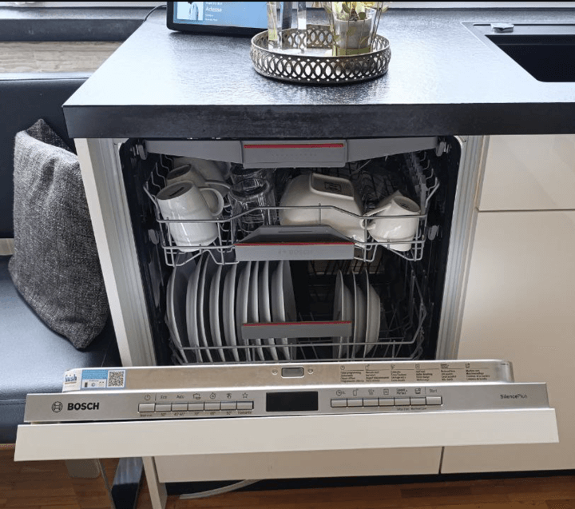
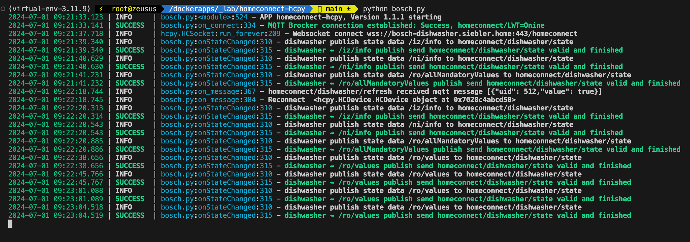

# Homeconnect  - hcpy for Bosch Dishwasher

[![License][license-shield]][license]
[![Open in Visual Studio Code][open-in-vscode-shield]][open-in-vscode]
[](https://www.python.org/downloads/release/python-3119/)
[![Support author][donate-me-shield]][donate-me]

[license-shield]: https://img.shields.io/static/v1?label=License&message=MIT&color=orange&logo=license
[license]: https://opensource.org/licenses/MIT

[open-in-vscode-shield]: https://img.shields.io/static/v1?label=+&message=Open+in+VSCode&color=blue&logo=visualstudiocode
[open-in-vscode]: https://open.vscode.dev/zibous/homeconnect-hcpy

[donate-me-shield]: https://img.shields.io/static/v1?label=+&color=orange&message=Buy+me+a+coffee
[donate-me]: https://www.buymeacoff.ee/zibous


Python tool to talk to Home Connect appliances over the local network (no cloud required)

## Device

Dishwasher Bosch SMV4HCX48E/24



## Interface with Home Connect appliances in Python

This is a very, very beta interface for Bosch-Siemens Home Connect
devices through their local network connection.  Unlike most
IoT devices that have a reputation for very bad security, BSG seem to have
done a decent job of designing their system, especially since
they allow a no-cloud local control configuration.  The protocols
seem sound, use well tested cryptographic libraries (TLS PSK with
modern ciphres) or well understood primitives (AES-CBC with HMAC),
and should prevent most any random attacker on your network from being able to
[take over your appliances to mine cryptocurrency](http://www.antipope.org/charlie/blog-static/2013/12/trust-me.html).

*WARNING: This tool not ready for prime time and is still beta!*

**More Information for details see**: <br/>
[](https://github.com/hcpy2-0/hcpy)

<br/>

### Used devices

- [Dishwasher Bosch `SMV4HCX48E/24`](https://amzn.eu/d/0id40Ixc)
- [Powermeter `Sonoff Pow`](https://tasmota.github.io/docs/devices/Sonoff-Pow/)
- [Watermeter `ESPHome+ESP32+CC1101`](https://github.com/zibous/ha-watermeter)

<hr size="1">
<br/>

## Setup

To avoid running into issues later with your default python installs, it's recommended to use a py virtual env for doing this.
I have had good experiences with `pyenv` With `pyenv` you can use your own Python versions / virtual environment for each application.<br/>

[](https://github.com/pyenv/pyenv)


## Python Setup

Go to your desired test directory, and:

```bash
⚡ user@linux: pyenv --version
⚡ user@linux: pyenv install 3.10.14
⚡ user@linux: pyenv virtualenv 3.10.14 apps
⚡ user@linux: pyenv local apps
⚡ user@linux: git clone https://github.com/hcpy2-0/hcpy
⚡ user@linux: cd hcpy
⚡ user@linux: pip install -r requirements.txt
⚡ user@linux: pip install pipreqs
⚡ user@linux: pip install pyclean
```

<br/>

## Create `devices.json`

The `hc-login.py ` script perfoms the OAuth process to login to your
Home Connect account with your usename and password.  It
receives a bearer token that can then be used to retrieves
a list of all the connected devices, their authentication
and encryption keys, and XML files that describe all of the
features and options.

### Requirements:

  - Valid singlekey-id account (username, password)
  - Device registered with singlekey-id account

<br/>

```bash
  ⚡ user@linux: python hc-login.py singlekey.id.email singlekey.id.password >config/devices.json
```

<br/>

This only needs to be done once or when you add new devices;
the resulting configuration JSON file *should* be sufficient to
connect to the devices on your local network, assuming that
your mDNS or DNS server resolves the names correctly.

Result for Dishwasher Bosch SMV4HCX48E/24: [devices.json](./homeassistant/devices_dishwasher.json)

<br/><br/>

## Start Application

After the config.json and devices.json are in the ./config directory, the application can be started with the python command

Use the following ./config/config.json example see: [config.json](./homeassistant/config.json)
and [devices.json](./homeassistant/devices.json)

<br/>

### Python APP

```bash
⚡ user@linux: /dockerapps/homeconnect:  python bosch.app
```
<br/>


### Docker APP
The application can also be installed with a Docker installation.
A local Docker image is created with `build.sh` and then installed.

Build script see:  [Docker build script](./build.sh)

<br/>

Go to your desired test directory, and:
```bash
⚡ user@linux: /dockerapps/homeconnect:  bash build.sh
```

<br/>

### Application logging loguru.logger



<br/><br/>

## What's Changed

-  **NEW hcpy lib files**
   - Replace print, dprint with `loguru.logger`

- **h2mqtt.py**
   - `bosch.app` instead of `h2mqtt.py`
   -  loading `settings.json` instead of `settings.ini`
   -  simple dishwascher state manager
   -  `onStateChanged` to get the energie- and water consumption

- **HCDevice.py**

  -  **Modified** <br/>
     - self.device_id = base64url_encode(get_random_bytes(6)).decode("UTF-8")<br/>

  - **<span>Disabled Error 404,400</span>**

     -  added section `resources` <br/>
        see: [devices.json](./homeassistant/devices.json)<br/>

     -  added section `addons` <br/>
        With the entries in the `addons` section, additional components can be created.
        For example, to record the energy and water consumption per session, a Sonoff device is used as
        a `power meter` and an `ESP water meter` is used for water consumption.
        see: [devices.json](./homeassistant/devices.json)<br/>

-  **NEW paho-mqtt Version: 2.1.0** <br>
    [MQTT version 5.0 client](https://eclipse.dev/paho/files/paho.mqtt.python/html/client.html)


<br/><br/>


## MQTT Payload

The application always sends an MQTT message when something has changed in the `states`.
Sample output see: [payload.json](./homeassistant/payload.json)<br/>

<br/>
<hr size="1">

## Homeassisant

Instead of MQTT Discovery, I use an MQTT template (see directory `/homeassistant/dishwasher.yaml`) to use the device with the settings in Homeassistant.

- [Homeassistant Template for Bosch Dishwasher](./homeassistant/dishwasher.yaml)

<br/><br/>

##  Questions & Open Tasks

- Why are the resource data evaluated but not translated (see [payload.json](./homeassistant/payload.json))
   - 520
   - 535
   - 547
   - 4632
   - 4641
   - 4654

- How do the options work for the appliance options (see HCDevice.py lines 134 -138)
    ```python
        if "options" in data:
            for option in data["options"]:
                option_uid = option["uid"]
                if str(option_uid) not in self.features:
                    raise ValueError(f"Unable to configure appliance. Option UID
                                       {option_uid} is not" " valid for this device.")
    ```

<br/><br/>

## Additional Informations


- [Python tool to talk to Home Connect appliances osresearch/hcpy](https://github.com/osresearch/hcpy)
- [Python tool to talk to Home Connect appliances hcpy2-0/hcpy](https://github.com/hcpy2-0/hcpy)
- [SingleKey ID, One Digital Key for Many Brands](https://singlekey-id.com)
- [Bosch Products Homepage](https://www.bosch-home.at)
- [Home Connect – Connect your household](https://api-docs.home-connect.com/quickstart/)
- [Connect Developer Program](https://developer.home-connect.com/)
